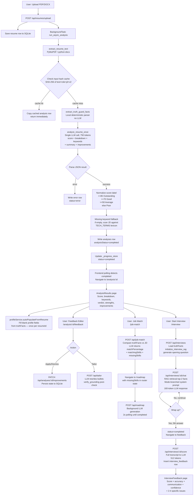
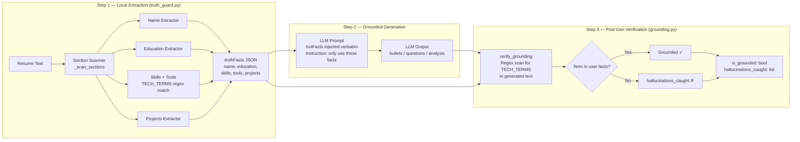
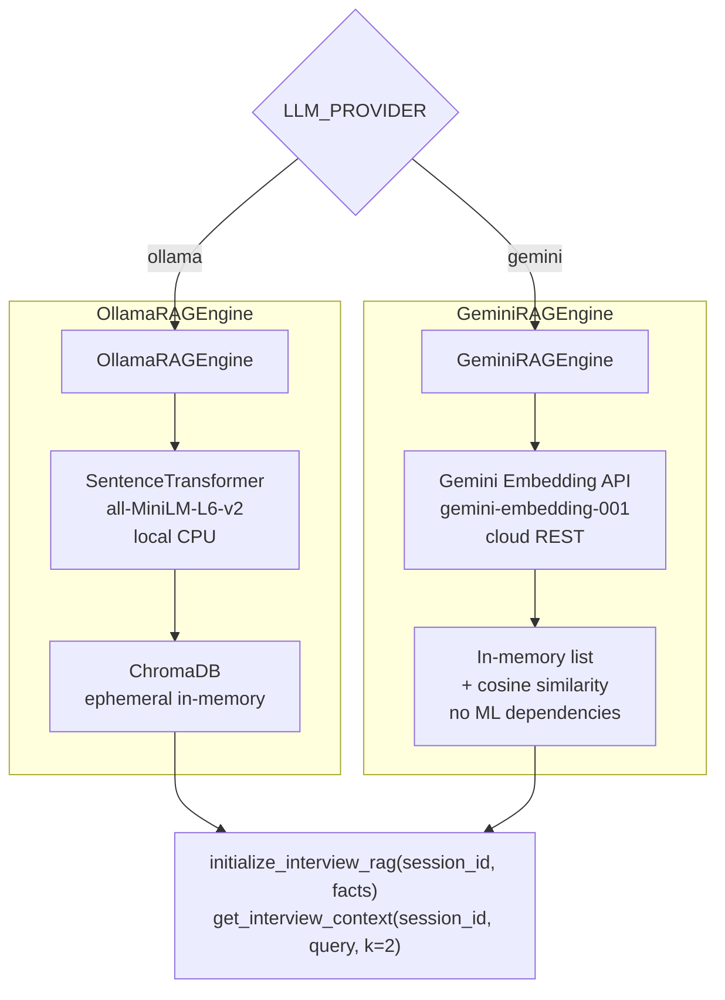
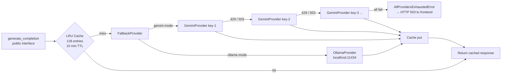

# Nexora — Architecture

## Tech Stack

| Layer | Technology | Version / Notes |
|---|---|---|
| **Frontend framework** | React | 19.x |
| **Frontend language** | TypeScript | ~6.0.2 |
| **Frontend build tool** | Vite | ^8.2.2 |
| **Frontend routing** | react-router-dom | ^7.18.2 |
| **Frontend icons** | lucide-react | ^1.34.0 |
| **Frontend styles** | CSS Modules | Per-component `.module.css` |
| **Frontend linter** | oxlint | ^1.79.0 |
| **Backend framework** | FastAPI | Python |
| **Backend language** | Python | 3.10+ |
| **Backend server** | uvicorn | ASGI |
| **LLM — local** | Ollama + qwen2.5:1.5b | Fully offline, no API key |
| **LLM — cloud** | Google Gemini API | gemini-3.5-flash (default), configurable |
| **Embeddings — cloud** | Google Gemini Embedding API | gemini-embedding-001, used in Gemini mode |
| **Embeddings — local** | sentence-transformers | all-MiniLM-L6-v2, used in Ollama mode |
| **Vector store — local** | ChromaDB | Ephemeral in-memory, Ollama mode only |
| **PDF parsing** | PyMuPDF (pymupdf) | Page-by-page text extraction |
| **DOCX parsing** | python-docx | Paragraphs + table cells |
| **Database** | SQLite | Local file `nexora.db`, auto-created on startup |
| **Env management** | python-dotenv | Reads `backend/.env` |

---

## High-Level Architecture

```
┌────────────────────────────────────────────────────────────────────┐
│                   React 19 SPA  (Vercel / localhost:5173)          │
│                                                                    │
│  Landing  →  Dashboard  →  ResumeUpload  →  AnalysisResults       │
│  ResumeFeedback  →  InterviewRoom  →  InterviewFeedback            │
│  JobMatch  →  Roadmap  →  Recommendations  →  Profile             │
│  AnalysisHistory                                                   │
│                                                                    │
│  Config: VITE_API_BASE  (defaults to Render backend URL)          │
└────────────────────────────┬───────────────────────────────────────┘
                             │ HTTP/REST  JSON
                             ▼
┌────────────────────────────────────────────────────────────────────┐
│           FastAPI Backend  (Render / localhost:8000)               │
│                                                                    │
│  CORS: allow_origins=["*"]   (all origins, no credentials)        │
│                                                                    │
│  ┌──────────────┐  ┌────────────────┐  ┌──────────────────────┐  │
│  │  Resume API  │  │ Interview API  │  │ Tailor / Match /     │  │
│  │  main.py     │  │ interview.py   │  │ Roadmap APIs         │  │
│  └──────┬───────┘  └───────┬────────┘  └──────────┬───────────┘  │
│         │                  │                       │              │
│  ┌──────▼──────────────────▼───────────────────────▼───────────┐  │
│  │                    Core Pipeline                            │  │
│  │  truth_guard.py  ·  grounding.py  ·  rag_pipeline.py       │  │
│  │  pdf_parser.py   ·  llm_client.py  ·  database.py          │  │
│  └──────────────────────────────────────────────────────────────┘  │
└───────────────────────┬────────────────────────────────────────────┘
                        │
          ┌─────────────┼──────────────────────────┐
          ▼             ▼                          ▼
   SQLite DB      LLM Provider              RAG Engine
   nexora.db      (env-selected)            (env-selected)
                  │                         │
          ┌───────┴───────┐        ┌────────┴────────┐
          │    ollama     │        │  Ollama mode    │
          │  localhost:   │        │  SentTrans +    │
          │  11434        │        │  ChromaDB       │
          │               │        ├─────────────────┤
          │    gemini     │        │  Gemini mode    │
          │  googleapis   │        │  Gemini Embed.  │
          │  .com         │        │  API + in-mem   │
          └───────────────┘        └─────────────────┘
```

---

## Complete Application and Data Flow



---

## Internal Processing Flow: Truth Guard + Grounding



---

## RAG Pipeline — Provider-Aware Design

The interview RAG system has two fully independent implementations selected by `LLM_PROVIDER` at runtime. Both expose the same public interface.



**Why two engines:**
- Ollama mode runs on a developer's machine that already has torch/transformers installed for the local LLM. The extra ~280 MB is acceptable.
- Gemini mode targets Render's 512 MB free tier. Importing torch would exceed the memory budget at startup and trigger an OOM kill. The Gemini engine uses only stdlib + the already-present `http.client`, keeping RSS under ~80 MB at boot.

---

## LLM Client — Failover Architecture



Multiple Gemini keys are supported via `GEMINI_API_KEY`, `GEMINI_API_KEY_1`, `GEMINI_API_KEY_2`, ... (up to 99). When a key hits its rate limit, the next key is tried automatically. The active provider index is remembered in-process so repeated calls don't retry exhausted keys.

---

## Database Schema

Six tables, all managed by `init_db()` in `database.py`. The function is idempotent (`CREATE TABLE IF NOT EXISTS`) and includes additive column migration guards.

```sql
-- Each uploaded resume
resumes (
    id TEXT PRIMARY KEY,      -- "resume-{8-char hex}"
    filename TEXT,
    targetRole TEXT,
    careerLevel TEXT,         -- student | recent grad | job seeker | career switch
    uploadedAt TEXT,          -- Unix timestamp as string
    jobDescription TEXT       -- Optional pasted JD; migrated in if absent
)

-- Analysis results (one per resume)
analyses (
    id TEXT PRIMARY KEY,      -- "analysis-{resumeId}"
    resumeId TEXT,
    score INTEGER,            -- 0–100
    status TEXT,              -- Poor | Average | Good | Outstanding (deterministic)
    breakdown TEXT,           -- JSON: {content,impact,skills,experience,formatting,
                              --        missing_keywords,keyword_source,verdict_reason}
    summary TEXT,
    strengths TEXT,           -- JSON array
    improvements TEXT,        -- JSON array of improvement objects
    truthFacts TEXT,          -- JSON: {name,education,skills[],tools[],projects[]}
    analysisStatus TEXT,      -- completed | error  (migrated in if absent)
    inputHash TEXT            -- SHA-256 for cache lookup (migrated in if absent)
)

-- Interview sessions
interviews (
    id TEXT PRIMARY KEY,      -- "interview-{8-char hex}"
    resumeId TEXT,            -- migrated in if absent
    type TEXT,                -- HR | Technical | Resume-Based
    status TEXT,              -- in-progress | completed
    startedAt TEXT,           -- ISO 8601 UTC
    currentQuestionIndex INTEGER,
    questionsCount INTEGER,   -- always 5
    chatHistory TEXT          -- JSON array of {id,sender,text,timestamp}
)

-- Post-session scoring (one per session, idempotent)
interview_feedback (
    id TEXT PRIMARY KEY,      -- "fb-{sessionId}"
    sessionId TEXT,
    type TEXT,
    score INTEGER,            -- 0–100 overall
    accuracy INTEGER,         -- technical correctness
    communication INTEGER,    -- clarity and structure
    confidence INTEGER,       -- firmness of assertions
    feedbackSummary TEXT,
    issues TEXT               -- JSON array of {id,type,description,suggestion}
)

-- Job match results
job_matches (
    id TEXT PRIMARY KEY,      -- "match-{8-char hex}"
    resumeId TEXT,
    targetRole TEXT,
    matchPercentage INTEGER,
    matchingSkills TEXT,      -- JSON array
    missingSkills TEXT        -- JSON array
)

-- Career roadmaps
roadmaps (
    id TEXT PRIMARY KEY,      -- "roadmap-{8-char hex}"
    targetRole TEXT,
    missingSkills TEXT,       -- JSON array
    steps TEXT                -- JSON array of {month,title,focus,whyItMatters}
)
```

---

## Frontend Structure

The frontend is a React 19 SPA built with Vite. There is no global state management library; all state is component-local via `useState`/`useEffect`. Services are plain async modules.

### Routing

All routes inside the app shell are wrapped in `AppLayout`, which renders the `Sidebar` and `Topbar` around the page `<Outlet>`. The landing page (`/`) renders outside the layout.

| Route | Page component | Purpose |
|---|---|---|
| `/` | `Landing` | Marketing entry point |
| `/dashboard` | `Dashboard` | KPI cards, health bars, activity feed |
| `/resume-analysis` | `ResumeUpload` | Upload form + polling UI |
| `/analysis/:id` | `AnalysisResults` | Score, breakdown, keywords, strengths |
| `/analysis/:id/feedback` | `ResumeFeedback` | 5-tab editor + tailoring |
| `/interview` | `InterviewModeSelect` | Mode + resume picker |
| `/interview/:sessionId` | `InterviewRoom` | Real-time chat UI |
| `/interview/:sessionId/feedback` | `InterviewFeedback` | Score + issue breakdown |
| `/job-match` | `JobMatch` | JD input + match result |
| `/roadmap` | `Roadmap` | Month-by-month learning plan |
| `/recommendations` | `Recommendations` | Derived action items |
| `/analysis-history` | `AnalysisHistory` | Past uploads list |
| `/profile` | `Profile` | Auto-populated user profile |
| `*` | `NotFound` | 404 fallback inside layout |

### API Configuration

`frontend/src/config.ts` exports a single `API_BASE` constant:

```typescript
export const API_BASE =
  import.meta.env.VITE_API_BASE || 'https://nexora-ogeo.onrender.com/api';
```

For local development, create `frontend/.env.local` with:
```
VITE_API_BASE=http://127.0.0.1:8000/api
```

### Key Frontend Patterns

- **Progress polling:** `ResumeUpload.tsx` uses `setInterval` (2-second cadence) to poll `GET /api/resumes/:id/status`. Navigates to `/analysis/:id` when `status === "completed"`.
- **Roadmap polling:** `Roadmap.tsx` polls `GET /api/roadmap/:id/status` at 2-second intervals until `status === "completed"`.
- **Optimistic UI:** `InterviewRoom.tsx` appends the user's message to the local state immediately before the server round-trip completes, then syncs back from the server response.
- **Profile auto-population:** `AnalysisResults.tsx` calls `profileService.autoPopulateFromResume()` once per `resumeId` using an `AUTOFILL_LAST_RESUME_KEY` guard in `localStorage`. Only blank fields are filled; manual edits are preserved.
- **Recommendation derivation:** `recommendationService.buildRecommendations()` builds action items by fetching live resume and interview data. Nothing is hardcoded.
